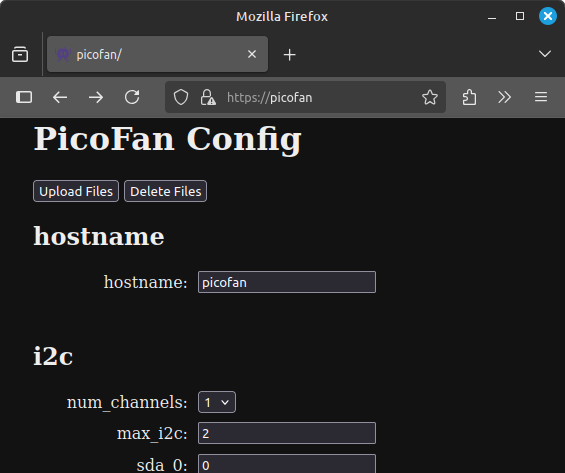

# Pico Venti

Raspberry Pi Pico W based Fan controller

## Available Features

* SHT4X temperature and humidity sensors
* NTC Thermistor
* PWM Fan control
* Web based setting management
* Publish readings to Grafana via InfluxDB

## Installation

Use venv to install the development requirements and use  mpremote to install this project as well as the dependency `ssd1306`

### Setup your workspace

```bash
git clone git@github.com:Mosical/pico-venti.git
cd pico-venti/
python3 -m venv pico-venti
source pico-venti/bin/activate
python3 -m pip install -r requirements-dev.txt
```

### Install to the pico

*Note the pico may be available at a different device name than /dev/ttyACM0 depending on your PC*

```bash
mpremote connect /dev/ttyACM0 mip install ssd1306
mpremote connect /dev/ttyACM0 fs cp -r static/ :static/
mpremote connect /dev/ttyACM0 fs cp -r hardware_drivers/ :hardware_drivers/
mpremote connect /dev/ttyACM0 fs cp -r network_drivers/ :network_drivers/
mpremote connect /dev/ttyACM0 fs cp example_config.json :config.json
mpremote connect /dev/ttyACM0 fs cp boot.py :main.py
```

You can also copy over an SSL Certificate and Key in DER format named cert.der and key.der now if you would like to use HTTPS for the webservers

## Usage

Once plugged into power the pico-venti will start running automatically

*Fan power needs to be provided separately if using 12V fans but 5V fans will allow powering the fan and VSYS from the same PSU*
*Once final hardware is designed it will include a 12V-5V buck converter so only one power input is needed*

### First time setup

If no SSID credentials are found on the pico it will start a web server with a login page
SSID: pico-venti
PASSWORD: raspberry
IP: 192.168.4.1


### Configuring 

The example_config.json should work without modification if hardware is built as outlined in this repo

The exception to this is the InfluxDB Configuration which will need to be set in order to work.
While it can be set by modifying the config.json file all settings can also be modified using a web based configuration tool

If using the default settings go to `https://picoventi` or the IP address displayed on the OLED screen



You can also upload and delete files, such as to adding SSL certificates or removing SSID credentials to login to a new wifi network. Simply click on the `Upload Files` or `Delete Files` buttons on the configuration page


## Hardware

**TODO:** Will outline the parts used and construction soon

Currently still testing, once finalized I will be working on a PCB, designs will also be in this repo


## Notes

Some [notes](notes.md) about planning and functionality. Will revamp documentation with a proper GHPages setup